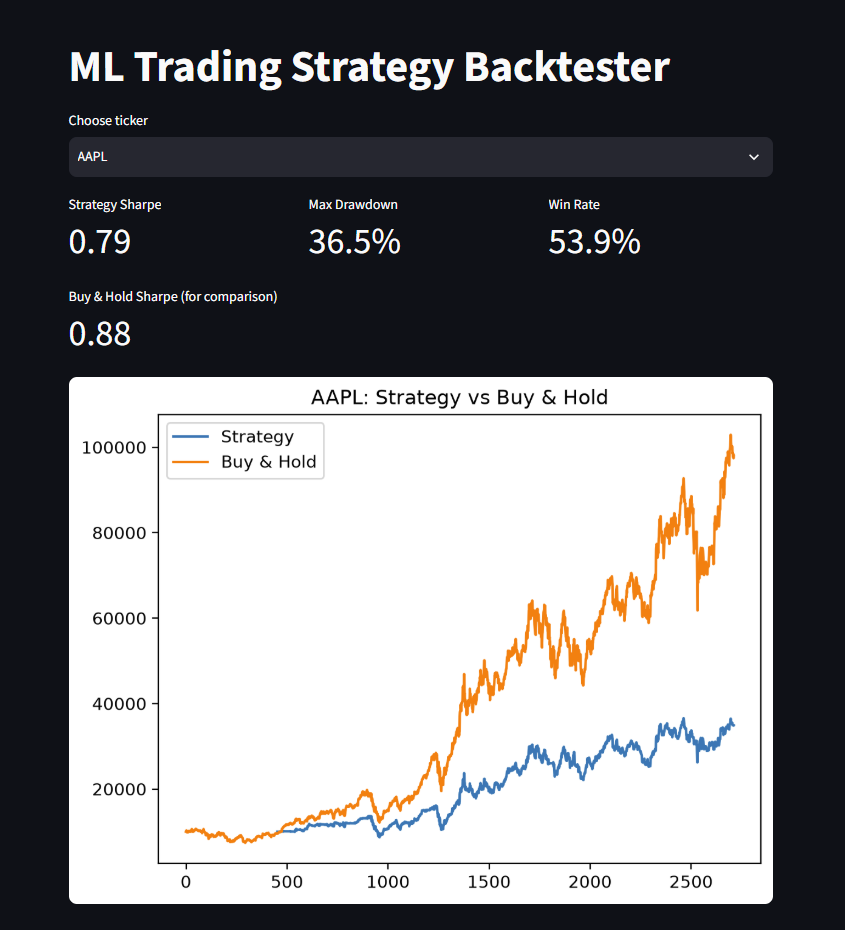

# ML-Driven Algorithmic Trading Backtester

A machine learning system that predicts short-term stock price direction using technical
indicators, then rigorously backtests the resulting trading strategy against a buy-and-hold
benchmark across 8 tickers — with walk-forward validation to avoid look-ahead bias, and
honest reporting of where the strategy does and doesn't add value.

**[Live Demo](https://ml-trading-backtester.streamlit.app/)** — try it yourself, pick any ticker, see live results.


*(Replace this with an actual screenshot of your Streamlit app — see "Adding a screenshot" below)*

---

## Summary

Given a stock's recent price/volume history, can a machine learning model predict whether
the price will be higher or lower in 5 trading days — well enough to build a trading strategy
that beats simply buying and holding?

**Short answer: sometimes, and the "when" is the interesting part.** The model shows a modest
but real risk-adjusted edge (higher Sharpe ratio than buy-and-hold) on 3 of 8 tickers tested —
specifically on more volatile, less relentlessly trending names (GOOGL, TSLA) and the
diversified index (SPY) — while underperforming on stocks that saw smooth, sustained bull runs
(AAPL, MSFT, AMZN, NVDA), where any time spent out of the market simply costs return.

---

## Methodology

**Data**: Daily OHLCV price data for 8 liquid tickers (AAPL, MSFT, GOOGL, AMZN, SPY, JPM, NVDA,
TSLA) from 2015–2026, sourced via the `yfinance` API.

**Features**: 8 technical indicators computed from price/volume alone — 1/5/10-day returns,
10 vs 50-day moving average ratio, 14-day RSI, 10-day rolling volatility, volume ratio, and
Bollinger Band position. All features use only information available as of the current day
(no look-ahead).

**Label**: Binary classification — did the stock's price rise over the following 5 trading days?

**Model**: Random Forest classifier, trained and evaluated with **walk-forward (time-series)
cross-validation** — never a random train/test split, since that would leak future information
into training and produce artificially inflated accuracy.

**Backtest**: Simulated using `vectorbt`, converting daily predictions into next-day positions
(shifted by one day to avoid trading on same-day information), with a 0.1% transaction cost
assumption per trade applied to every simulated buy/sell.

**Evaluation**: Sharpe ratio, max drawdown, and win rate, each compared against a buy-and-hold
benchmark on the same ticker over the same period.

---

## Results

| Ticker | Strategy Return | Benchmark Return | Strategy Sharpe | Benchmark Sharpe | Win Rate | Max Drawdown | Beats Benchmark (Sharpe)? |
|--------|-----------------:|------------------:|-----------------:|-------------------:|----------:|---------------:|:---:|
| AAPL   | 249.1%  | 879.4%   | 0.79 | 0.88 | 54.5% | 36.5% | No |
| MSFT   | 275.9%  | 1264.6%  | 0.87 | 1.04 | 62.1% | 33.6% | No |
| GOOGL  | 553.9%  | 1027.9%  | 1.10 | 0.92 | 65.3% | 34.1% | **Yes** |
| AMZN   | 334.5%  | 1143.6%  | 0.81 | 0.88 | 61.8% | 63.4% | No |
| SPY    | 174.0%  | 297.2%   | 0.86 | 0.81 | 53.5% | 33.7% | **Yes** |
| JPM    | 109.7%  | 604.8%   | 0.54 | 0.80 | 52.5% | 49.7% | No |
| NVDA   | 3740.2% | 34098.0% | 1.30 | 1.35 | 64.5% | 57.8% | No |
| TSLA   | 1542.6% | 3621.7%  | 1.02 | 0.87 | 49.6% | 72.7% | **Yes** |

*Walk-forward validated, 2015–2026, 0.1% transaction cost per trade.*

---

## Key learnings

**Total return is the wrong metric to lead with here.** Every ticker's benchmark return dwarfs
the strategy's, because 2015–2026 included one of the strongest sustained bull markets in
market history. Almost no active strategy that periodically exits the market beats "just hold"
in that regime — missing even a handful of the market's best days is extremely costly. Sharpe
ratio (return per unit of risk) is the more honest lens, and by that measure the picture is more
nuanced: 3 of 8 tickers show a real, if modest, edge.

**The edge shows up specifically on more volatile, less relentlessly trending names.** GOOGL,
TSLA, and SPY all have more give-and-take price action — real pullbacks and drawdowns along the
way — where correctly timing exits has more value. AAPL, MSFT, AMZN, and NVDA, by contrast, had
smoother, more sustained climbs where sitting out at all is costly regardless of how well-timed.

**Transaction costs are a real, quantifiable drag.** With ~150-170 simulated trades per ticker
at 0.1% per trade, fees meaningfully erode returns — a reminder that a strategy's raw predictive
accuracy and its *tradeable* profitability after realistic costs are two different questions.

**Modest Sharpe improvements (1.10 vs 0.92, not 3.0 vs 0.9) are the believable outcome.**
A dramatically larger edge in a backtest like this would be a stronger signal of overfitting or
a data leakage bug than of genuine skill — daily stock direction prediction using basic technical
indicators is a hard, close-to-efficient-market problem, and small, explainable edges are the
honest result to expect and report.

---

## Limitations & what I'd add next

- **No significance testing yet**: the Sharpe differences above are point estimates; a bootstrap
  confidence interval on returns would clarify whether the 3-ticker edge is likely real or within
  noise. (Planned — see `notebooks/` for work in progress.)
- **Single prediction horizon (5 days)** and **single confidence threshold (0.5)** — a sensitivity
  analysis across horizons and thresholds would show whether results are robust to these choices
  or fragile to one specific setup.
- **Backtest only, not yet live**: next step is paper trading via a broker API (e.g. Alpaca) to
  validate the pipeline against live market data and real order execution mechanics, without risking
  real capital.
- **Single-stock models**: each ticker currently has its own model trained on ~2,700 rows. A pooled
  model trained across all 8 tickers (with ticker as a feature) would have far more training data
  and likely generalize better.

---

## Tech Stack

`Python` · `pandas` / `numpy` · `scikit-learn` · `vectorbt` · `yfinance` · `Streamlit` · `matplotlib`

---

## Project Structure

```
ml-trading-backtester/
├── src/
│   ├── data_loader.py    # yfinance data pull + local caching
│   ├── features.py       # technical indicator engineering + label creation
│   ├── model.py           # walk-forward validated Random Forest training
│   ├── backtest.py       # vectorbt-based strategy simulation
│   └── metrics.py         # Sharpe, max drawdown, win rate calculations
├── app/
│   └── streamlit_app.py  # interactive dashboard, deployed live
├── notebooks/             # exploration and analysis notebooks
├── data/                  # cached price data (not committed)
└── requirements.txt
```

---

## Running it locally

```bash
git clone https://github.com/Mrigna01/ml-trading-backtester.git
cd ml-trading-backtester
python -m venv venv
venv\Scripts\activate          # Windows
pip install -r requirements.txt
streamlit run app/streamlit_app.py
```

---